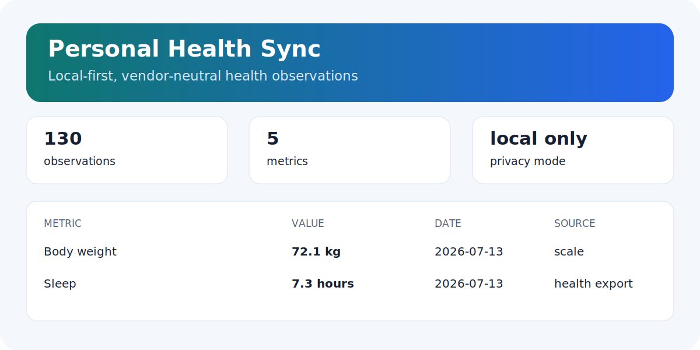

<div align="center">

# Personal Health Sync

### Turn health exports into one private, portable timeline

Normalize generic CSV records and optional connector output into a small local observation store, then generate an offline HTML dashboard you can keep, inspect, and move between devices.

[](https://github.com/shkyyy18/personal-health-sync/actions/workflows/ci.yml)
[](https://github.com/shkyyy18/personal-health-sync/releases/latest)
[](https://www.python.org/)
[](LICENSE)
[](pyproject.toml)

[**60-second demo**](#60-second-demo-no-account-or-hardware) | [Connector matrix](#connector-and-hardware-matrix) | [Roadmap](ROADMAP.md) | [Contributing](CONTRIBUTING.md)

**Cross-platform core | Local-only | Synthetic demo | Optional hardware connectors**

</div>



## 60-second demo: no account or hardware

```bash
git clone https://github.com/shkyyy18/personal-health-sync.git
cd personal-health-sync
python -m pip install -e .
healthsync --store demo-store.json demo --days 30 --dashboard dashboard.html
```

Open `dashboard.html`. It contains clearly labelled synthetic data, works offline, and makes no network requests.

Import your own normalized CSV later:

```bash
healthsync --store health.json import-csv examples/observations.csv
healthsync --store health.json dashboard --output dashboard.html
healthsync --store health.json status --json
```

```csv
date,code,value,unit,source,display
2026-07-10,body-weight,72.4,kg,xiaomi-scale,Body weight
```

Repeated imports are idempotent by `(date, code, source)`.

## What works today

- A dependency-free, cross-platform Python core.
- Generic CSV import with a documented observation shape.
- Deterministic local merge, latest-value queries, and daily summaries.
- A synthetic demo that proves the workflow without credentials or devices.
- A self-contained HTML dashboard with no server and no external assets.
- Optional legacy Strava and Xiaomi scripts kept separate from the stable core.

The useful core remains testable even when a hardware vendor changes an endpoint, authentication flow, or export format.

## Connector and hardware matrix

Exact status matters more than a long vendor list.

| Device or ecosystem | Usable path today | Status |
|---|---|---|
| Any source with normalized CSV | `healthsync import-csv` | Stable |
| Strava | `scripts/strava_sync.py` | Optional connector |
| Xiaomi / Mi Fitness scale | `scripts/mifitness_sync.py` | Experimental; unofficial API |
| Xiaomi Home discovery | `scripts/mijia_health_sync.py` | Experimental; unofficial API |
| Apple Watch / Apple Health | Generic CSV only | Native export adapter planned for v0.3 |
| Android Health Connect | Generic CSV only | Export adapter planned for v0.3 |
| Huawei Health devices and scales | Generic CSV only | Export adapter planned for v0.4 |
| Garmin | Generic CSV only | Export adapter planned for v0.4 |
| Other Bluetooth scales | Export through a compatible app, then normalize to CSV | Device-specific connector not included |

"Planned" does not mean supported today. A new adapter must include synthetic fixtures, document authentication and network behavior, and avoid proprietary sample data.

For Android users who need direct Bluetooth scale support now, projects such as openScale may provide the device layer; Personal Health Sync focuses on the vendor-neutral local interchange and reporting layer.

## Why this exists

Health data is fragmented across watches, phones, scales, sports platforms, and proprietary apps. This project separates the system into two layers:

1. **Stable local core** - normalization, merge, query, demo, and portable reporting.
2. **Optional connectors** - vendor APIs or exported files that can evolve independently.

This is deliberately not another cloud account. The store is a readable JSON file and the dashboard is a portable HTML file.

## Local data model

Each record uses a deliberately small, FHIR-inspired shape:

```json
{
  "resourceType": "Observation",
  "date": "2026-07-10",
  "code": "body-weight",
  "display": "Body weight",
  "value": 72.4,
  "unit": "kg",
  "source": "xiaomi-scale"
}
```

It is not a complete FHIR implementation. The goal is a predictable local interchange format for dashboards, scripts, and personal agents.

## Privacy and safety

- The core performs no network requests and has zero runtime dependencies.
- Real stores, tokens, QR images, account sessions, secrets, logs, and `data/` are gitignored.
- Demo and test fixtures are synthetic.
- Do not upload health records to issues or pull requests.
- The generated dashboard embeds records in the local HTML file; protect it like the source data.
- This is a personal data tool, **not medical software**. It does not diagnose, treat, or provide emergency guidance.

See [SECURITY.md](SECURITY.md) before enabling a vendor connector.

## Add a connector

Contributions are welcome, especially export adapters that can be tested without real accounts or hardware. Start with an issue that documents:

- the vendor and export format;
- whether network access or credentials are required;
- a minimal synthetic fixture;
- field mapping into the observation model;
- privacy, rate-limit, and maintenance risks.

Read [CONTRIBUTING.md](CONTRIBUTING.md) and [ROADMAP.md](ROADMAP.md).

## Development

```bash
python -m pip install -e .
python -m unittest discover -s tests -v
python -m compileall -q healthsync tests
python -m healthsync --store demo-store.json demo --days 7
```

CI runs on Windows and Linux with Python 3.10 and 3.12.

## Project status

Version 0.2 is an early but usable local core. Generic import, merge, demo, query, and reporting are ready for validation. Vendor-specific coverage is intentionally limited and tracked separately in the roadmap.

## License

MIT. Third-party connector libraries retain their own licenses and terms.
